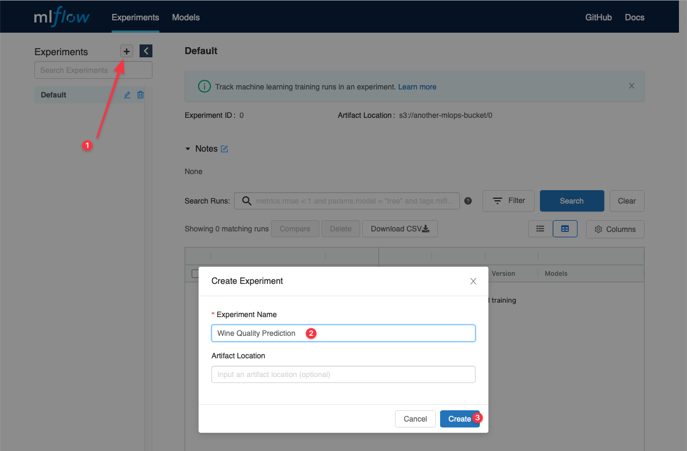
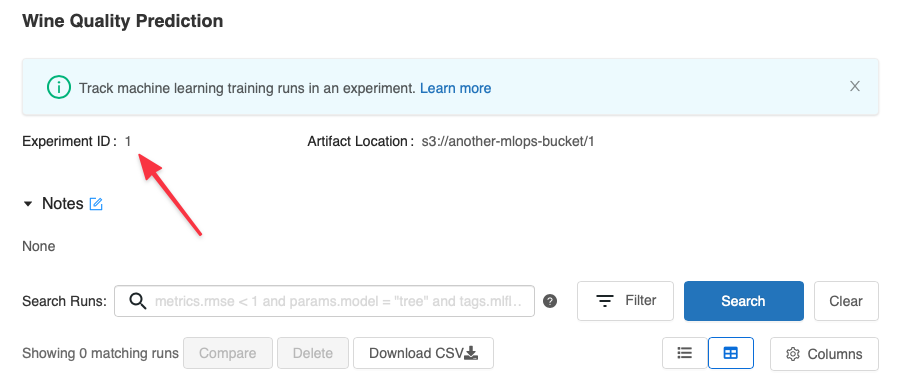
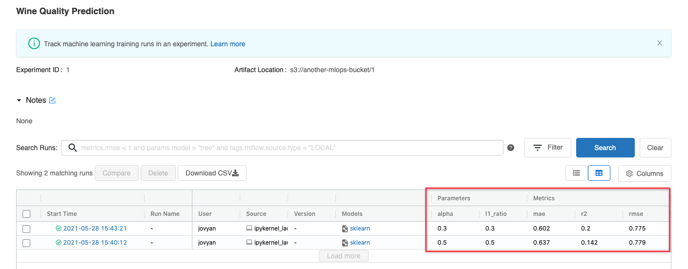
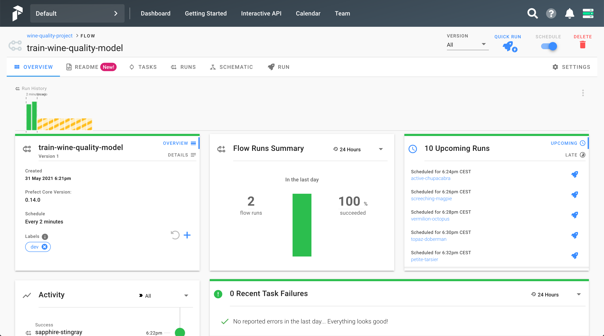
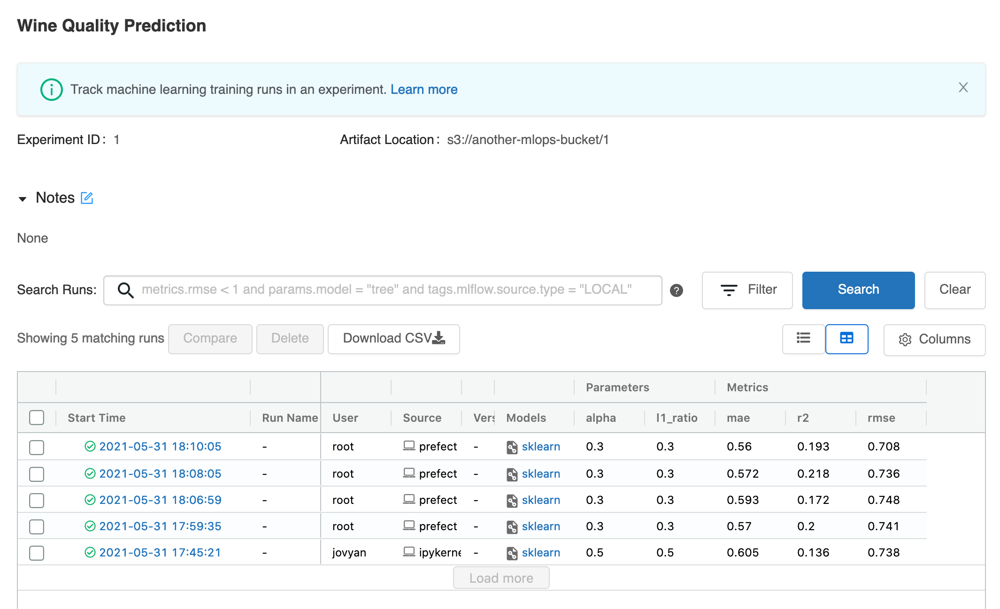
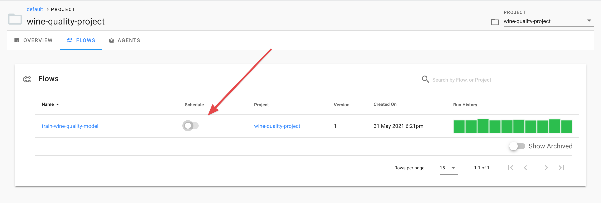

# Creating a basic machine learning system on Open MLOps

Now that you've [set up your Open MLOps](https://github.com/datarevenue-berlin/OpenMLOps/blob/master/tutorials/set-up-open-source-production-mlops-architecture-aws.md) architecture, you'll want to build something with it to see how all the pieces fit together. Let's start with a simple machine learning model to predict wine quality ratings, based on the properties of the wine. Specifically, we will

* Use JupyterHub to write code to fetch the data, process it, and train a model
* Create an experiment on MLFlow so that we can keep track of different models and parameters
* Set up Prefect tasks to fetch the data periodically, retrain the model, and register the results with MLFlow

In a later tutorial, we will extend this project to use some of the other services that make up Open MLOps.

## Accessing the services

To access each of the services, you'll need to have an account registered at [https://mlops.example.com/profile/auth/registration](https://mlops.example.com/profile/auth/registration), switching out `example.com` for your own domain. 

You'll also need the shared JupyterHub password that you set in the YAML config while setting up the infrastructure.


## Getting data and training a model

Visit https://jupyter.mlops.example.com and create a new Python notebook in the persistent folder (to avoid losing your work). First, we'll simply be using scikit-learn and some common data processing libraries. Add the following imports to the first cell in the notebook and run it.


```python
from sklearn.metrics import mean_squared_error, mean_absolute_error, r2_score
from sklearn.model_selection import train_test_split
from sklearn.linear_model import ElasticNet

import pandas as pd
import numpy as np
```

Now let's fetch some data. We'll be using a basic CSV file from UCI, available at http://archive.ics.uci.edu/ml/machine-learning-databases/wine-quality/winequality-red.csv. Add a new cell with the following code, and run it.


```python
def fetch_data():
    csv_url = "http://archive.ics.uci.edu/ml/machine-learning-databases/wine-quality/winequality-red.csv"
    data = pd.read_csv(csv_url, sep=";")
    return data

data = fetch_data()
data.head()
```


You can see that this data can easily be used to train a machine learning model. We have a bunch of numerical columns describing the make up of different wines, followed by a quality raiting in the final column. Our research question is *Can we predict the wine's quality by analysing its components?*

Next, we'll add some code to train and evaluate a basic ElasticNet model, which is a basic model based on linear regression. In producion use cases, you'll likely use a more sophisticated model and a larger and more complex data set.


```python
def eval_metrics(actual, pred):
    rmse = np.sqrt(mean_squared_error(actual, pred))
    mae = mean_absolute_error(actual, pred)
    r2 = r2_score(actual, pred)
    return rmse, mae, r2

def train_model(data, alpha=0.5, l1_ratio=0.5):

    train, test = train_test_split(data)

    # The predicted column is "quality" which is a scalar from [3, 9]
    train_x = train.drop(["quality"], axis=1)
    test_x = test.drop(["quality"], axis=1)
    train_y = train[["quality"]]
    test_y = test[["quality"]]


    lr = ElasticNet(alpha=alpha, l1_ratio=l1_ratio, random_state=42)
    lr.fit(train_x, train_y)

    predicted_qualities = lr.predict(test_x)
    rmse, mae, r2 = eval_metrics(test_y, predicted_qualities)

    # Print out metrics
    print("Elasticnet model (alpha=%f, l1_ratio=%f):" % (alpha, l1_ratio))
    print("  RMSE: %s" % rmse)
    print("  MAE: %s" % mae)
    print("  R2: %s" % r2)
```

You can check that everything works so far by adding the following two lines a new cell and running them.

```python
data = fetch_data()
train_model(data)
```

You should see that the model trains in a couple of seconds and outputs the various metrics that we defined. If you've run machine learning experiments before, you'll know that it's often a headache to keep track of different runs, parameters, and results, so our next step is to set up MLFlow to log everything that we do automatically.

## Setting up experiment tracking with MLFlow

Visit https://mlflow.mlops.example.com and choose to create a new experiment.



Note the experiment ID , as we'll need to add this to our code. It should be `1` if you haven't used MLFlow before.



Now we'll need to install MLFlow in our Jupyter environment. In a new cell, run the following.

```
!pip install mlflow
```

Now add `import mlflow` at the top with your other imports and rerun that cell.

Finally, modify your `train_model` function to look as follows.


```python
def train_model(data, mlflow_experiment_id, alpha=0.5, l1_ratio=0.5):
    mlflow.set_tracking_uri("http://mlflow.mlflow:5000")

    train, test = train_test_split(data)

    # The predicted column is "quality" which is a scalar from [3, 9]
    train_x = train.drop(["quality"], axis=1)
    test_x = test.drop(["quality"], axis=1)
    train_y = train[["quality"]]
    test_y = test[["quality"]]
    
    with mlflow.start_run(experiment_id=mlflow_experiment_id):
        lr = ElasticNet(alpha=alpha, l1_ratio=l1_ratio, random_state=42)
        lr.fit(train_x, train_y)
        predicted_qualities = lr.predict(test_x)
        (rmse, mae, r2) = eval_metrics(test_y, predicted_qualities)

        print("Elasticnet model (alpha=%f, l1_ratio=%f):" % (alpha, l1_ratio))
        print("  RMSE: %s" % rmse)
        print("  MAE: %s" % mae)
        print("  R2: %s" % r2)

        mlflow.log_param("alpha", alpha)
        mlflow.log_param("l1_ratio", l1_ratio)
        mlflow.log_metric("rmse", rmse)
        mlflow.log_metric("r2", r2)
        mlflow.log_metric("mae", mae)

        mlflow.sklearn.log_model(lr, "model")
```

Note some important changes in the new `train_model` method:

* The new parameter, `mlflow_experiment_id`, which lets us associated runs with a specific experiment
* We set the URI of our MLFlow instance. The `mlflow.mlflow` specifies a namespace within our Kubernetes cluster where MLFlow is running.
* The new `with` block that starts a run on MLFlow
* The `mlflow.log_metric` calls which post our results back to MLFlow
* The `log_model` call at the end which saves the entire trained model to MLFlow. This is useful to ensure we never lose a model that we previously trained.

Now train the model twice more - first with the default parameters, and then with modified ones.

```python
train_model(data, mlflow_experiment_id=1, alpha=0.3, l1_ratio=0.3)
train_model(data, mlflow_experiment_id=1, alpha=0.5, l1_ratio=0.5)
```



You can see that each run was recorded in MLFlow, with the date, inputs, and outputs.

Often data sources are constantly updated, so we want to retrain a model periodically. In this case, our CSV file is static, but let's set up Prefect to fetch the data and retrain the model every two minutes for demonstration purposes.

## Prefect

Update the first cell again, with new imports that we'll need for interacting with Prefect.

```python
from prefect import task, Flow, Parameter, Client
from prefect.run_configs import KubernetesRun
from prefect.schedules import IntervalSchedule
from prefect.storage import S3

from sklearn.metrics import mean_squared_error, mean_absolute_error, r2_score
from sklearn.model_selection import train_test_split
from sklearn.linear_model import ElasticNet

from datetime import timedelta

import numpy as np
import pandas as pd

import mlflow
import requests
```

Now modify the `fetch_data` and `train_model` functions by adding the `@task` decorator to each. This will indicate to Prefect that these are units of work which need to be run, and which may depend on each other in some way.

```python
@task
def fetch_data():
    csv_url = "http://archive.ics.uci.edu/ml/machine-learning-databases/wine-quality/winequality-red.csv"
    data = pd.read_csv(csv_url, sep=";")
    return data
 
@task
def train_model(data, mlflow_experiment_id, alpha=0.5, l1_ratio=0.5):
    mlflow.set_tracking_uri("http://mlflow.mlflow:5000")
 
    train, test = train_test_split(data)
    # ...
```

Next, in a new cell, set up some variables so we can talk to Prefect more easily. You'll need to enter the domain and S3 bucket name that you used when setting up the infrastruture, as well as the username and password that you used in the registration step at the start of this article.

```python
domain = "mlops.ritza-route53.com"  # the domain where you are hosting Open MLOps
username = "gareth@ritza.co"        # the username you used to register on Open MLOps
password = "DkguP5GsB9yiPk8"        # the password you used to register on Open MLOps
s3_bucket = "another-mlops-bucket"  # the S3 bucket you specified when setting up Open MLOps

prefect_project_name = "wine-quality-project"         # you can use what you want here
docker_image = "drtools/prefect:wine-classifier-3"    # any docker image that has the required Python dependencies


auth_url = f"https://{domain}/.ory/kratos/public/self-service/login/api"
prefect_url = f"https://prefect.{domain}/graphql"

def get_prefect_token():
    r = requests.get(auth_url)
    jsn = r.json()
    action_url = jsn["methods"]["password"]["config"]["action"]
    data = {"identifier": username, "password": password}
    headers = {"Accept": "application/json", "Content-Type": "application/json"}
    r = requests.post(action_url, json=data, headers=headers)
    jsn = r.json()
    session_token = jsn["session_token"]
    return session_token
```

Directly below, add some code to create and register the Prefect flow.

```python
def create_prefect_flow():
    run_config = KubernetesRun(
        labels=["dev"],
        service_account_name="prefect-server-serviceaccount",
        image=docker_image
    )
    storage = S3(s3_bucket)

    session_token = get_prefect_token()
    prefect_client = Client(api_server=prefect_url, api_token=session_token)
    schedule = IntervalSchedule(interval=timedelta(minutes=2))

    with Flow("train-wine-quality-model", schedule, storage=storage, run_config=run_config) as flow:
        data = fetch_data()
        train_model(data=data, mlflow_experiment_id=1, alpha=0.3, l1_ratio=0.3)

    prefect_client.create_project(project_name=prefect_project_name)
    training_flow_id = prefect_client.register(flow, project_name=prefect_project_name)
    flow_run_id = prefect_client.create_flow_run(flow_id=training_flow_id, run_name=f"run {prefect_project_name}")
    
create_prefect_flow()
```

Prefect will fetch the data and train the model every 2 minutes - this is probably too often for this particular use case, but it will let you see that everything is working without having to wait too long.

Navigate back to the Prefect dashboard and you'll see the tasks - both those that are completed and the ones scheduled for the future.



Prefect has also calculated how the tasks rely on each other automatically, and you can view the calculated [DAG](https://en.wikipedia.org/wiki/Directed_acyclic_graph). In our case, it's very simple: training the model depends on fetching the data, but Prefect would have figured out the full graph even for complicated inter-connected DAGs.


Wait a few minutes and check the MLFlow dashboard - you should see the runs recorded every two minutes.



As each run is using resources (downloading data from the web, training the model, and storing the full model binary in S3), we probably want to turn it off again. We can do this in the Prefect interfact by toggling the "schedule" toggle to off.



## Deploying your model

Now that you've seen how to schedule a training task and track changes in results, you'll want to deploy your model so that you can create predictions on new data. Follow [Deploying a model to production with Prefect and Seldon](./deploy-model-seldon.md) to see how.


